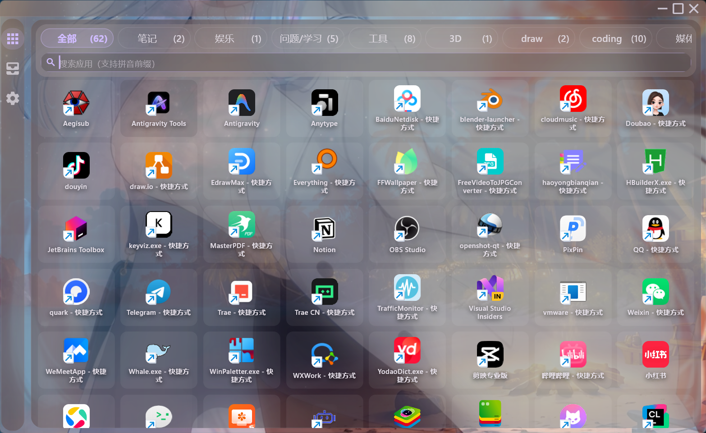
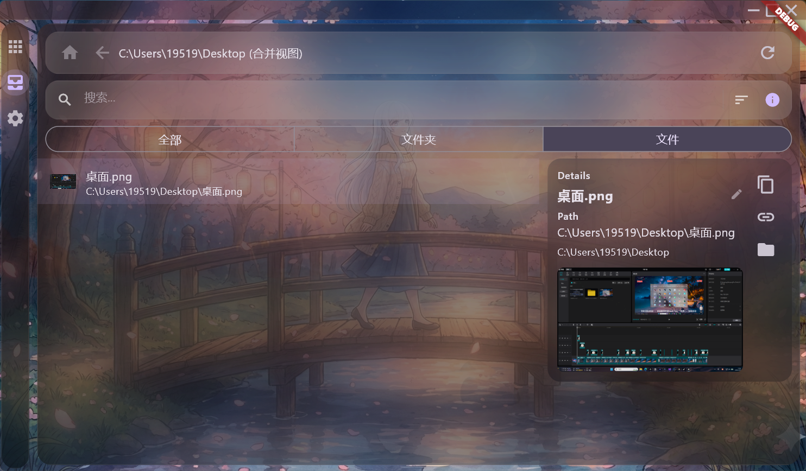
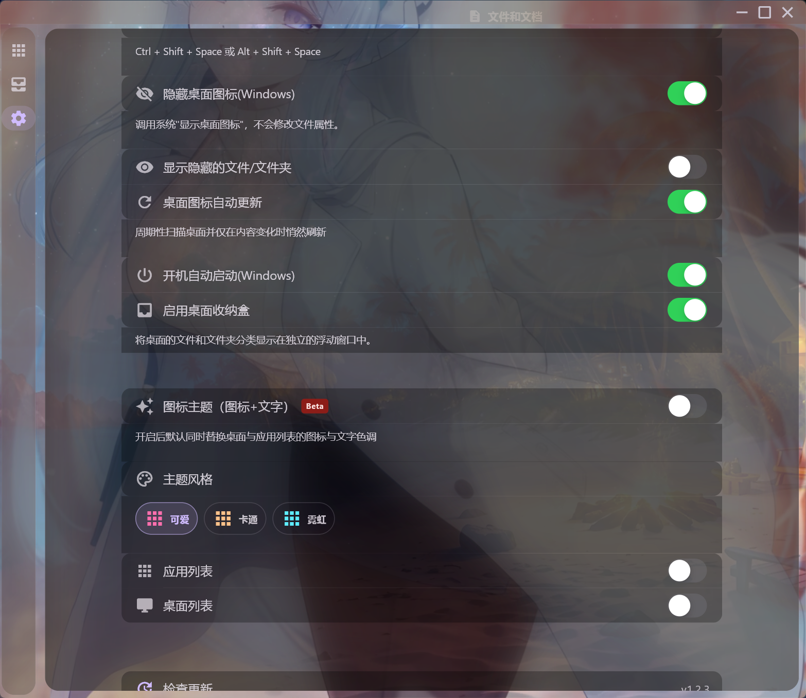
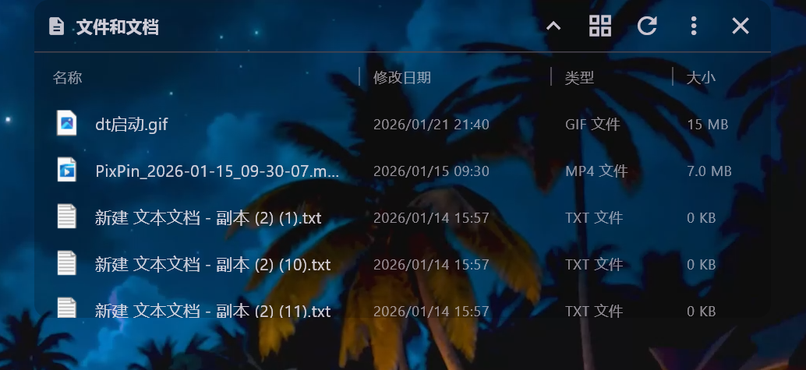

# Desk Tidy

> 🪟 **Windows 桌面整理神器** — 让你的桌面清爽如新

**🇨🇳 中文** | **[🇬🇧 English](README_EN.md)**

<!-- 主界面截图：请将截图放入 .github/screenshots/hero.png -->


---

## ✨ 亮点特性

<table>
<tr>
<td width="50%">

### ⚡ 极致轻量
- **CPU 占用 ≈ 0%**（待机状态）
- **内存 ~280MB**
- **安装包仅 11.8MB**，安装后 58MB
- 后台静默运行，不打扰工作

</td>
<td width="50%">

### 🎯 即刻唤醒
- **全局快捷键** `Ctrl + Shift + Space`
- 备用快捷键 `Alt + Shift + Space`
- **系统托盘** 右键菜单控制
- 热区唤醒（按住 Ctrl + 鼠标左上角）

</td>
</tr>
<tr>
<td>

### 🎨 现代视觉
- 磨砂玻璃效果，融入桌面
- 自定义透明度与模糊强度
- 支持自定义背景图片
- 深色/浅色/跟随系统主题

</td>
<td>

### 🔍 智能搜索
- **拼音首字母**模糊匹配
- 键盘 ↑↓←→ 导航，回车直达
- 唤醒后自动聚焦搜索框

</td>
</tr>
</table>

---

## 🖼️ 界面预览

<!-- 功能截图：请将截图放入 .github/screenshots/ 文件夹 -->
| 应用启动器 | 文件管理 | 个性设置 |
|:---:|:---:|:---:|
|  |  |  |

---

## 🚀 核心功能

### 📱 应用快捷启动
- 自动扫描桌面快捷方式
- **真实图标**显示，非通用占位符
- 双击/回车即刻启动
- 支持**分类整理**，自定义应用分组

<!-- 快速启动演示：请将 GIF 放入 .github/screenshots/demo.gif -->


### 📁 文件统一管理
- 桌面文件/文件夹一目了然
- 右键菜单：打开、移动、删除、复制
- 支持**打开方式**选择
- 操作结果实时反馈

### 🧲 磁吸自动隐藏

窗口具备智能吸附功能，配合全屏工作场景使用：

| 功能 | 说明 |
|-----|------|
| **吸附触发** | 将窗口拖到**屏幕左上角**松开即吸附 |
| **吸附范围** | 左上角约 **200×150 像素**区域（自动适配屏幕） |
| **自动隐藏** | 吸附后，鼠标离开窗口约 **260ms** 即隐藏到托盘 |
| **重新唤醒** | 使用快捷键或托盘菜单重新显示 |

> 💡 **提示**：拖动窗口过程中不会触发吸附，只有松开鼠标且窗口在吸附区域内才会生效。

### 🔥 热区唤醒（可选）

> 有了全局快捷键后，热区功能作为**辅助手段**，适合习惯鼠标操作的用户。

| 热区位置 | 屏幕左上角，宽度约 1/4 屏幕，高度约 10 像素 |
|---------|------------------------------------------|
| 触发方式 | 按住 `Ctrl` 键 + 鼠标移入热区 |
| 使用场景 | 适合不方便使用键盘时快速唤醒 |

### 🎛️ 高度可定制

| 设置项 | 说明 |
|-------|------|
| 窗口透明度 | 0% ~ 100% 无级调节 |
| 磨砂强度 | 从清透到朦胧 |
| 图标大小 | 24px ~ 96px |
| 背景图片 | 支持自定义壁纸 |
| 主题模式 | 深色 / 浅色 / 跟随系统 |
| 开机自启 | 一键设置 |

### 🖥️ 桌面图标管理
- **一键隐藏/显示**系统桌面图标
- 让原生桌面干净整洁
- 所有内容通过 Desk Tidy 统一访问

### 📦 桌面收纳盒

> 将桌面上的文件和文件夹分类展示在独立的浮动窗口中，让桌面保持整洁的同时仍能快速访问。

| 特性 | 说明 |
|-----|------|
| **分类展示** | 文件夹和文件分别显示在独立窗口 |
| **外观同步** | 自动继承主程序的透明度、磨砂等外观设置 |
| **智能对齐** | 支持拖拽定位，自动记忆位置 |
| **随主程序启动** | 在设置中一键开启/关闭 |

<!-- 收纳盒截图：请将截图放入 .github/screenshots/box_demo.png -->


> 📁 收纳盒由独立子项目 [desk_tidy_box](https://github.com/sqmw/desk_tidy_box) 实现，与主程序协同工作。

---

## ⌨️ 快捷键

| 快捷键 | 功能 |
|-------|------|
| `Ctrl + Shift + Space` | 唤醒窗口（主） |
| `Alt + Shift + Space` | 唤醒窗口（备） |
| `↑` `↓` `←` `→` | 导航选择 |
| `Tab` / `Shift + Tab` | 线性导航 |
| `Enter` | 打开选中项 |
| `Esc` | 隐藏窗口 |

---

## 📦 安装

### 方式一：下载安装包（推荐）

| 项目 | 大小 |
|-----|------|
| 安装包 | **11.8 MB** |
| 安装后 | **58 MB** |

从 [Releases](https://github.com/your-username/desk_tidy/releases) 下载最新版安装包。

### 方式二：从源码构建

```bash
# 克隆项目
git clone https://github.com/your-repo/desk_tidy.git
cd desk_tidy

# 安装依赖
flutter pub get

# 运行
flutter run -d windows

# 构建发布版本
flutter build windows --release
```

---

## 🔧 技术栈

- **框架**: Flutter (Windows Desktop)
- **语言**: Dart + C++ (Win32 原生扩展)
- **图标提取**: Windows Shell API
- **窗口管理**: window_manager + 原生 HWND 操作

---

## 📋 系统要求

| 项目 | 要求 |
|-----|------|
| 操作系统 | Windows 11（64 位）；Win10 理论兼容但未详细测试 |
| 磁盘空间 | 约 58 MB |
| 运行内存 | ~280 MB |

---

## 🗺️ 路线图

- [x] 全局快捷键唤醒
- [x] 拼音模糊搜索
- [x] 分类管理
- [x] 磁吸自动隐藏
- [x] 桌面收纳盒
- [ ] 多显示器支持
- [ ] 插件系统
- [ ] 云同步配置

---

## 📄 开源协议

MIT License

---

<p align="center">
  <b>⭐ 如果觉得有用，请给个 Star 支持一下！</b>
</p>
